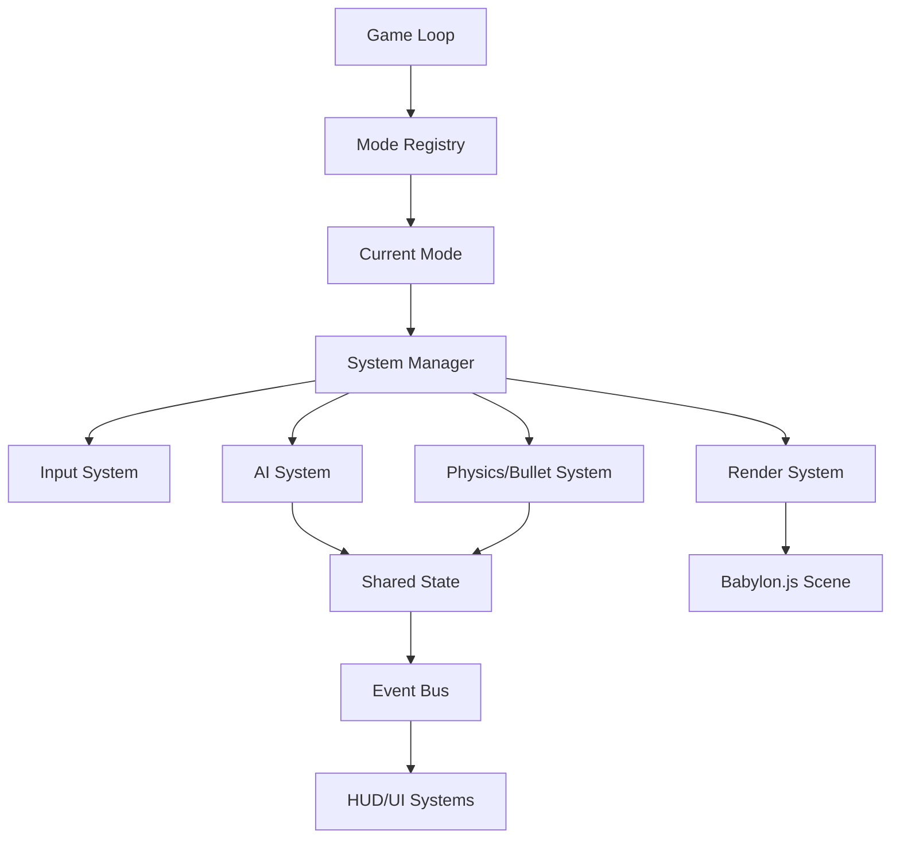

# Архитектурный анализ и план улучшений

## Текущее состояние
Проект представляет собой космический симулятор с несколькими режимами игры (бой, исследование, галактическая карта, станция). Используется Babylon.js.

### Сильные стороны:
- **Модульность**: Разделение на `entities`, `features`, `pages` и `shared`.
- **Системный подход**: Наличие интерфейса `GameSystem` и централизованного обновления через `updateSystems`.
- **Реактивность**: Использование собственной шины событий в `src/shared/events`.
- **Оптимизация**: Использование инстансинга для истребителей (`src/entities/fighter/instances.ts`).

### Слабые места (Точки роста):
1. **Глобальное состояние (God Object)**: `src/shared/state/index.ts` содержит слишком много разнородных данных. Это затрудняет отслеживание изменений и тестирование.
2. **Смешивание логики и представления**: В некоторых системах (например, `src/features/combat/bullet-system.ts`) логика столкновений напрямую управляет жизненным циклом мешей Babylon.js.
3. **Ручное управление жизненным циклом**: Инициализация и очистка систем в `src/pages/combat/index.ts` происходит вручную, что может привести к утечкам памяти при добавлении новых систем.
4. **Жесткая привязка к DOM**: UI-компоненты напрямую манипулируют DOM-элементами через `document.getElementById`, что затрудняет их повторное использование и тестирование.

---

## Предлагаемые улучшения

### 1. Переход к полноценному ECS (Entity Component System)
Хотя сейчас есть подобие систем, сущности (`Fighter`, `CapitalShip`) — это просто интерфейсы с данными.
- **План**: Выделить компоненты (Position, Velocity, Health, AI) и системы, которые работают только с наборами компонентов. Это позволит легко добавлять новые типы сущностей, просто комбинируя компоненты.

### 2. Децентрализация состояния
Разбить `GameState` на специализированные контексты или хранилища.
- **План**: Создать отдельные модули для состояния боя, состояния кампании и настроек игрока, используя паттерн Observable или небольшую библиотеку управления состоянием.

### 3. Абстракция над рендерингом (Scene Manager)
Создать слой, который отделяет игровую логику от API Babylon.js.
- **План**: Логика не должна знать о `Mesh` или `Scene`. Она должна оперировать идентификаторами сущностей, а специальный `RenderSystem` будет синхронизировать состояние сущностей с объектами Babylon.js.

### 4. Компонентный UI
Уйти от прямого манипулирования DOM в пользу легковесной библиотеки (например, Preact или создание собственных функциональных компонентов).
- **План**: Создать базовый класс или фабрику для UI-компонентов с четким жизненным циклом и механизмом обновления данных.

---

## План реализации (Этапы)

### Этап 1: Рефакторинг систем и состояния (Foundation)
- [ ] Инкапсулировать работу с `state` внутри систем.
- [ ] Создать `SystemManager` для автоматизации `init/update/cleanup`.
- [ ] Выделить `CombatState` из общего `state`.

### Этап 2: Улучшение взаимодействия сущностей
- [ ] Внедрить паттерн "Компонент" для расширения возможностей истребителей и кораблей.
- [ ] Унифицировать систему обработки урона через события.

### Этап 3: UI и Инструментарий
- [ ] Создать систему шаблонизации UI для уменьшения дублирования кода в `templates.ts`.
- [ ] Добавить отладочный слой (Debug Overlay) для визуализации векторов и состояний ИИ.

---

## Новые продвинутые идеи

### 5. Система "Data-Driven" контента
Сейчас параметры кораблей и оружия жестко прописаны в конфигах.
- **Идея**: Вынести описание всех предметов, кораблей и типов врагов в JSON-схемы.
- **Зачем**: Это позволит создавать новые типы контента без изменения кода систем, а также упростит создание редактора уровней/кораблей.

### 6. Улучшенный ИИ (Behavior Trees / Utility AI)
Текущий ИИ в `ai-system.ts` использует простую машину состояний (FSM) с `switch-case`.
- **Идея**: Внедрить деревья поведения (Behavior Trees) или Utility AI.
- **Зачем**: Это сделает поведение врагов более непредсказуемым и "умным" (например, отступление для ремонта, групповые атаки, использование способностей).

### 7. Система шейдерных эффектов (Post-Processing)
- **Идея**: Создать менеджер эффектов для управления пост-обработкой (Bloom, Motion Blur, Chromatic Aberration) в зависимости от игровых событий (прыжок в гиперпространство, получение урона).
- **Зачем**: Значительно повысит визуальное качество игры ("juice") при минимальных затратах на разработку.

### 8. Слой сетевой абстракции (для будущего мультиплеера)
- **Идея**: Внедрить систему "Команд" (Command Pattern) для управления игроком. Вместо прямого изменения позиции при нажатии клавиш, генерируется команда.
- **Зачем**: Это первый шаг к детерминированной логике, которая необходима для сетевой синхронизации.

### 9. Процедурная генерация миссий
- **Идея**: Создать генератор графа задач для контрактов (например: "Прилети в систему А -> Уничтожь разведчика -> Забери данные -> Доставь на станцию Б").
- **Зачем**: Сделает режим кампании бесконечно реиграбельным.

---

## Диаграмма связей систем (Mermaid)

Как вам такой план? Стоит ли углубиться в какой-то конкретный пункт (например, ECS или UI)?
