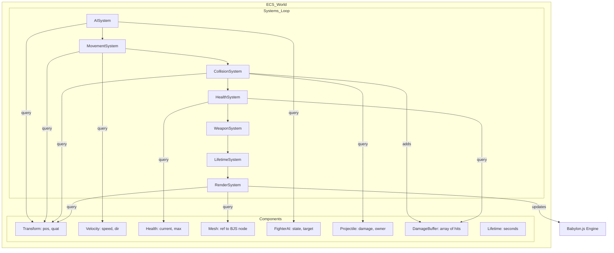

# Детальный план перехода на архитектуру Pure ECS

Этот документ описывает технические шаги по рефакторингу проекта Space Combat для перехода от гибридной модели к "чистой" ECS (Entity Component System).

## 1. Анализ текущего состояния
- **Ядро ECS**: Готово (World, SystemScheduler, EntityId).
- **Компоненты**: Описаны базовые классы, но требуют рефакторинга.
- **Логика**: Завязана на адаптеры (`Fighter`, `LaserData`) и глобальные массивы в `state.ts`.
- **Оценка**: 45/100 (фундамент есть, но системы не используют возможности ECS).

## 2. Целевая архитектура
Все игровые сущности управляются исключительно через `world.query()`. Глобальный `state.ts` больше не хранит списки объектов.

### Схема взаимодействия систем

## 3. Этапы реализации

### Этап 1: Рефакторинг компонентов
1.  **`TransformComponent`**: Удалить ссылку на `mesh`. Хранить только `position: Vector3` и `quaternion: Quaternion`.
2.  **`MeshComponent`**: Создать компонент для хранения ссылки на `TransformNode` Babylon.js.
3.  **`DamageBufferComponent`**: Создать компонент для накопления урона за кадр (массив объектов `{ amount, source }`).
4.  **`LifetimeComponent`**: Создать компонент для автоматического удаления сущностей (снаряды, эффекты).

### Этап 2: Реализация атомарных систем
Заменить текущие "мега-системы" на специализированные:
- **`MovementSystem`**: Интеграция скорости в позицию.
- **`AISystem`**: Логика выбора целей и управления вектором направления.
- **`CollisionSystem`**: Проверка пересечений сфер/лучей.
- **`WeaponSystem`**: Обработка таймеров перезарядки и спавн сущностей-снарядов.
- **`HealthSystem`**: Применение урона из буфера и удаление сущностей при HP <= 0.
- **`RenderSystem`**: Синхронизация `Transform` компонентов с мешами Babylon.js.

### Этап 3: Удаление Legacy-слоя
1.  Удалить `src/entities/ecs-adapters/`.
2.  Очистить `GameState` от массивов `allies`, `enemies`, `bullets` и т.д.
3.  Переписать `spawner-system.ts` на прямой вызов `world.createEntity()`.

### Этап 4: Обновление UI
1.  **Minimap**: Переписать на использование `world.query(TransformComponent, TeamComponent)`.
2.  **Markers**: Переписать на использование `world.query(TransformComponent, HealthComponent)`.

## 4. Ожидаемый результат
- **Масштабируемость**: Возможность обрабатывать 1000+ объектов без изменения кода систем.
- **Чистота**: Полное разделение данных (компоненты) и логики (системы).
- **Надежность**: Использование `EntityId` с генерациями исключает ошибки при обращении к удаленным объектам.
