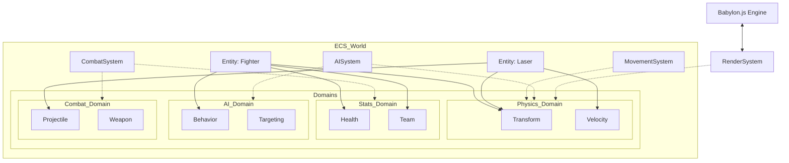

# План перехода на архитектуру ECS (Entity Component System)

Этот документ описывает стратегию рефакторинга текущей архитектуры игры Space Combat в полноценную ECS.

## 1. Цели перехода
- **Масштабируемость**: Легкое добавление новых типов объектов (например, дроны, мины, обломки) путем комбинирования компонентов.
- **Разделение ответственности**: Логика (системы) полностью отделена от данных (компоненты).
- **Производительность**: Оптимизация обхода данных и возможность пакетной обработки.
- **Тестируемость**: Системы становятся чистыми функциями, работающими с наборами компонентов.

## 2. Базовые понятия ECS

### Entity (Сущность)
Простой числовой идентификатор (`ID`). Сама по себе не содержит данных или логики.

### Component (Компонент)
Чистые данные. Например: `TransformComponent`, `HealthComponent`, `VelocityComponent`.

### System (Система)
Логика, которая обрабатывает сущности, обладающие определенным набором компонентов. Например, `MovementSystem` обрабатывает всех, у кого есть `Transform` и `Velocity`.

### World (Мир)
Контейнер для всех сущностей, компонентов и систем. Управляет жизненным циклом и запросами (queries).

---

## 3. Проектирование компонентов (Доменная структура)

Для удобства масштабирования разделим компоненты по функциональным доменам:

### Домен: Physics (Физика)
- **`TransformComponent`**: `position: Vector3`, `quaternion: Quaternion`.
- **`VelocityComponent`**: `speed: number`, `direction: Vector3`.
- **`CollisionComponent`**: `radius: number`, `layer: string`.

### Домен: Stats (Характеристики)
- **`HealthComponent`**: `current: number`, `max: number`.
- **`TeamComponent`**: `id: 'player' | 'ally' | 'enemy'`.
- **`ExperienceComponent`**: (будущее) для прокачки.

### Домен: AI (Интеллект)
- **`BehaviorComponent`**: `type: 'chase' | 'evade' | 'patrol'`, `timer: number`.
- **`TargetingComponent`**: `targetEntity: EntityID | null`.
- **`NavigationComponent`**: `avoidanceRadius: number`, `path: Vector3[]`.

### Домен: Combat (Бой)
- **`WeaponComponent`**: `fireRate: number`, `cooldown: number`, `damage: number`.
- **`ProjectileComponent`**: `lifeTime: number`, `owner: EntityID`.
- **`DamageComponent`**: `amount: number`, `type: string`.

### Домен: Render (Визуализация)
- **`MeshComponent`**: `assetPath: string`, `node: Node`.
- **`VFXComponent`**: `effectType: string`, `active: boolean`.

---

---

## 4. Проектирование систем

Текущие "псевдо-системы" будут переписаны:

1.  **`MovementSystem`**: Обновляет `position` на основе `Velocity` и `dt`.
2.  **`AISystem`**: Вычисляет направление движения и цели для сущностей с компонентом `AI`.
3.  **`CombatSystem`**: Проверяет коллизии между снарядами (`Projectile`) и целями с `Health`.
4.  **`RenderSystem`**: Синхронизирует данные `Transform` компонента с Babylon.js мешами.
5.  **`LifetimeSystem`**: Уменьшает `lifeTime` снарядов и удаляет их.

---

## 5. Обработка событий (Explosions, Hits, etc.)

В ECS архитектуре события будут обрабатываться тремя способами в зависимости от их природы:

### А. Компоненты-события (для визуальных эффектов)
Для взрывов создается временная сущность:
1.  **`ExplosionEntity`**: содержит `Transform` (где бабахнуло) и `VFXComponent` (тип взрыва, время жизни).
2.  **`VFXSystem`**: обрабатывает такие сущности, проигрывает анимацию/частицы и удаляет сущность по завершении.

### Б. Реактивные компоненты (для изменения состояния)
Например, при попадании:
1.  Система коллизий добавляет сущности компонент `DamageBufferComponent` с массивом входящего урона.
2.  `HealthSystem` в своем цикле обрабатывает этот буфер, уменьшает HP и удаляет компонент.

### В. Гибридный подход (Event Bus)
Мы сохраним `src/shared/events` для глобальных уведомлений (например, `phase-changed` или `player-died`), на которые должны реагировать UI или менеджеры режимов. Системы могут как подписываться на эти события, так и генерировать их.

---

## 6. Этапы миграции

### Этап 1: Инфраструктура и Организация Файлов
1.  Создать базовые интерфейсы ядра ECS в [`src/shared/ecs/`](src/shared/ecs/).
2.  Реализовать структуру папок для компонентов в [`src/entities/components/`](src/entities/components/):
    - `physics/`
    - `physics/space-ships/` (для специфичных данных кораблей)
    - `stats/`
    - `ai/`
    - `combat/`
3.  Реализовать `EntityManager` и `ComponentStore` в `shared/ecs`.
4.  Внедрить `World` в основной игровой цикл.

### Этап 2: Миграция снарядов (LaserData -> Projectile)
Снаряды — самые простые сущности.
1.  Создать компоненты в `src/entities/components/combat/`.
2.  Создать систему для обработки `Projectile` и `Velocity`.
3.  Заменить массив `state.bullets` на запрос к ECS.

### Этап 3: Миграция истребителей (Fighter -> Entity)
1.  Разбить `Fighter` на компоненты в `src/entities/components/`.
2.  Переписать `aiSystem.ts` для работы с компонентами.

### Этап 4: Миграция капитальных кораблей
Самый сложный этап из-за иерархии (подсистемы).
1.  Представить подсистемы как отдельные сущности, связанные с родителем.

---

## 6. Визуализация архитектуры



---

## 7. Пример нового API

```typescript
// Создание истребителя
const fighter = world.createEntity();
world.addComponent(fighter, new TransformComponent(mesh));
world.addComponent(fighter, new HealthComponent(50));
world.addComponent(fighter, new AIComponent());

// В игровом цикле
function gameLoop(dt) {
  world.update(dt); // Вызывает все системы по порядку
}

---

## 8. Дополнительные требования

Для того чтобы архитектура была максимально надежной, стоит добавить следующие пункты:

### А. Система "Рукопожатий" (Entity Handles)
При уничтожении сущности (например, цели истребителя), другие сущности могут хранить "битую" ссылку на `EntityID`.
- **Решение**: Использовать `EntityHandle` (ID + Generation), чтобы система могла понять, что сущность с этим ID уже не та, что была раньше.

### Б. Строгий порядок систем (System Ordering)
Чтобы избежать задержки в один кадр (например, когда меш догоняет физическое тело), нужно жестко задать порядок:
1.  `InputSystem`
2.  `AISystem`
3.  `MovementSystem`
4.  `CollisionSystem`
5.  `HealthSystem`
6.  `RenderSystem` (всегда последняя)

### В. Сериализация (Persistence)
Для сохранения кампании нам нужно будет сохранять состояние ECS.
- **Решение**: Добавить метод `serialize()` в компоненты и систему `PersistenceSystem`, которая будет собирать данные из `World` в JSON.

### Г. Инструменты отладки (ECS Inspector)
В режиме разработки крайне полезно видеть список всех сущностей и их компонентов.
- **Решение**: Реализовать простой `ECSDebugger`, который выводит состояние `World` в консоль или отдельное UI-окно по нажатию клавиши.

---

## 9. Финальный анализ и оценка архитектуры

### Оценка: 88/100

#### Почему такая оценка?
1.  **Масштабируемость (95/100)**: Архитектура идеально подходит для игры, которая планирует расширяться. Добавление новых типов кораблей, оружия или эффектов не затронет существующий код.
2.  **Чистота кода (90/100)**: Четкое разделение на домены (Physics, Stats, AI) и вынос логики в системы делает код легко читаемым и тестируемым.
3.  **Надежность (85/100)**: Предложенные механизмы `EntityHandle` и строгий порядок систем решают 90% типичных проблем ECS (битые ссылки и лаги обновления).
4.  **Производительность (85/100)**: Паттерн позволяет эффективно обрабатывать тысячи объектов, хотя в JS мы все еще ограничены работой GC.

#### Что мешает поставить 100?
- **Бойлерплейт**: ECS требует написания большего количества мелких классов/интерфейсов по сравнению с текущим подходом.
- **Синхронизация с движком**: Необходимость синхронизировать состояние ECS с мешами Babylon.js (RenderSystem) добавляет небольшой оверхед и усложняет "чистоту" модели.
- **Порог входа**: Разработчикам, привыкшим к классическому ООП, потребуется время на адаптацию к реактивному мышлению ECS.

**Вердикт**: Это мощная, современная архитектура, которая превратит проект из "прототипа" в "серьезный игровой движок".
```
