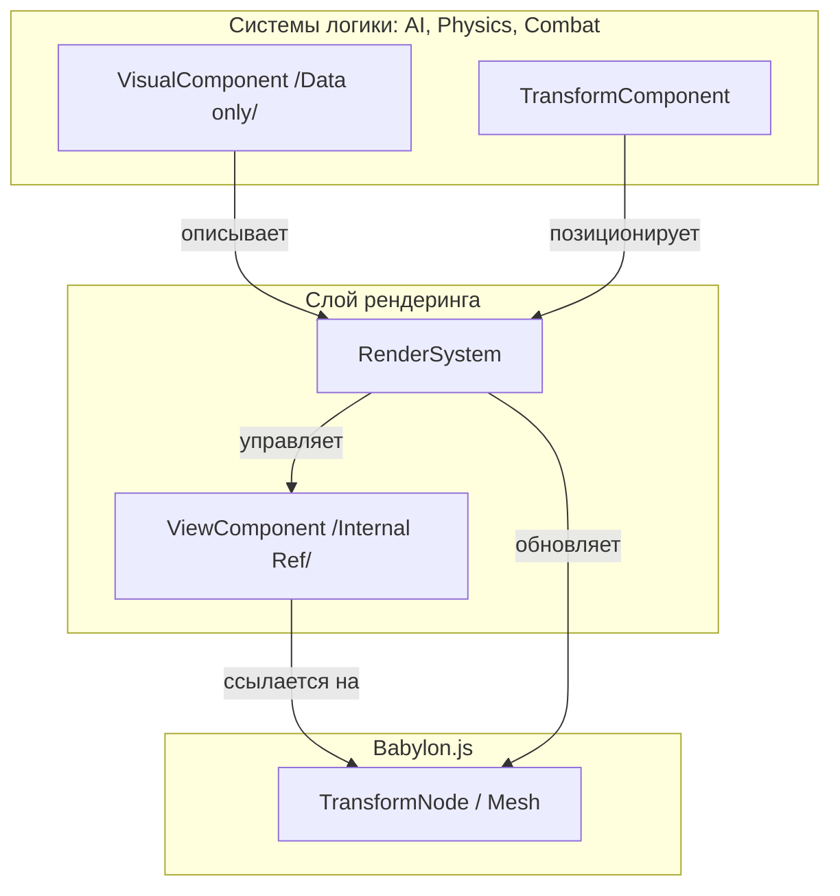

План перехода к абстракции над рендерингом (Scene Manager) декомпозирован на 5 фаз. Основная идея — превратить Babylon.js в «пассивный визуализатор», который лишь отображает состояние ECS-мира.

### Фаза 1: Ядро абстракции
На этом этапе мы создаем инфраструктуру, которая позволит существовать визуальным объектам без прямой связи с логикой.

1.  **`VisualComponent`**: Хранит только данные для рендеринга (`modelId`, `bodyColor`, `exhaustColor`). Это «заказ» на отрисовку.
2.  **`ViewComponent`**: Скрытый компонент, содержащий ссылку на реальный `Babylon.js TransformNode`. С ним работает *только* `RenderSystem`.
3.  **`RenderSystem`**:
    *   **Lifecycle**: Если видит `Visual` без `View` — создает меш. Если сущность удалена — делает `.dispose()`.
    *   **Sync**: Копирует `position` и `quaternion` из `TransformComponent` в Babylon-объект.

### Фаза 2: Иерархия и Мировые координаты
Сейчас логика (AI) полагается на `mesh.getWorldMatrix()` для поиска позиций подсистем. Чтобы это убрать, нам нужен расчет иерархии внутри ECS.

1.  **`HierarchySystem`**: Для сущностей с `ParentEntityComponent` вычисляет мировую позицию на основе позиции родителя и локального смещения. Результат записывается в `TransformComponent`.
2.  Это позволит AI знать, где находится турель, просто прочитав её `TransformComponent`.

### Фаза 3: Поэтапная миграция сущностей
Перевод объектов на новую схему, начиная с простых к сложным.

1.  **Снаряды**: Самый простой случай (нет иерархии, короткая жизнь).
2.  **Истребители**: Включает абстракцию `HealthBar` (логика просто говорит `isVisible: true`, а `RenderSystem` рисует полоску).
3.  **Корабли и подсистемы**: Самый сложный этап, требующий работающей `HierarchySystem`.

### Фаза 4: Декуплинг (отвязка) логики
Когда данные о позициях и визуалах разделены, мы чистим системы.

1.  **AI System**: Перестает импортировать `TransformNode` и использовать методы движка.
2.  **Collision System**: Работает только с `TransformComponent.position`.
3.  **Weapons & Spawner**: Вместо создания мешей и добавления их в сцену, они просто создают ECS-сущности с нужными компонентами.

### Фаза 5: Финальная очистка
1.  Удаление `MeshComponent`.
2.  Запрет импортов из `@babylonjs/core` во всех папках, кроме `shared/core`, `shared/engine` и новой `RenderSystem`.

---

### Визуализация структуры (Mermaid)

Этот план позволит нам в будущем легко заменить Babylon.js на другой движок (например, Three.js) или тестировать логику в чистом Node.js без графического окружения.

Вы согласны с этим планом, или стоит внести корректировки в порядок миграции?